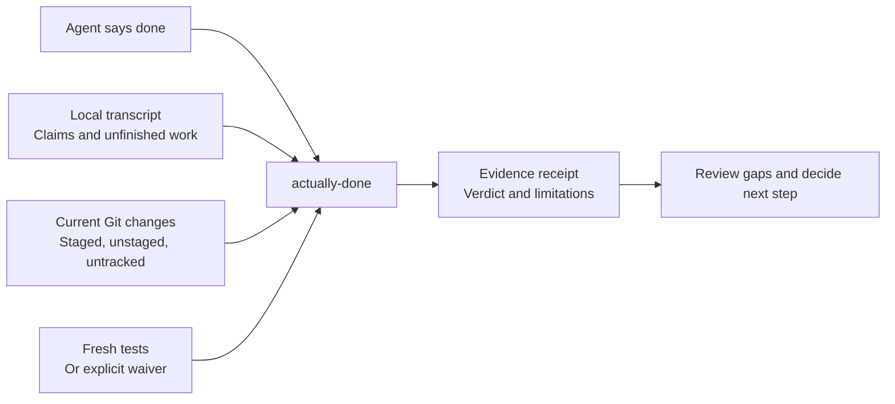
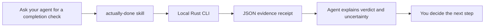
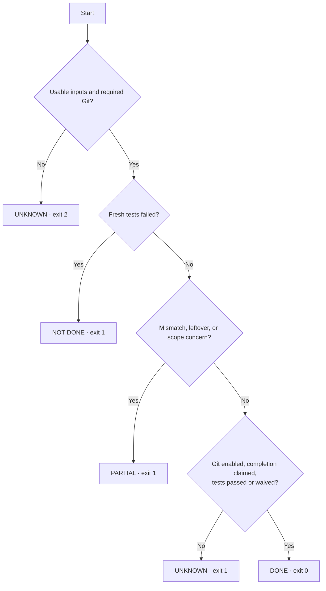
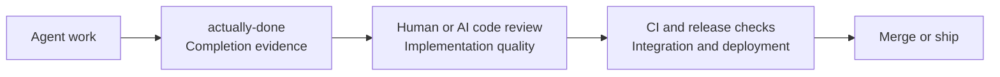

# actually-done — completion checks for Claude Code and Codex

**The agent said “done.” Get a receipt before you move on.**

A native Rust CLI that compares Claude Code and Codex completion claims with current Git changes, freshly run tests, and unresolved work in the transcript. One command gives you a terminal, JSON, or Markdown receipt—with evidence and uncertainty together.

**v0.1.0 · MIT · Local processing · No API key · No Python runtime**

This development checkout prepares **v0.1.1**. [Published downloads](https://github.com/M-Umer-Farooq-Dev/actually-done/releases) remain the source of released artifacts; CI packages are previews. See [distribution and adoption](docs/distribution.md) for release, website, and measurement steps.

## Why use it?

An agent can report success while mentioning a follow-up, claiming a file that is absent from current changes, or citing tests you have not rerun. Reading the whole conversation to find those gaps takes time.

`actually-done` turns that handoff into a repeatable check. Use it after an agent finishes, before reviewing a diff, or when handing work to a teammate. It helps you decide what to inspect next; it does not prove that the implementation is correct.



## Install from source

You need Git and Rust 1.85 or newer. CI runs the native tests and release builds on Windows, Linux, and macOS with Rust 1.85. Windows x64 also has broader provider compatibility and process-cleanup verification. Dependencies download during the first build. Once installed, the CLI processes transcripts locally.

From this checkout:

```console
cargo install --locked --path .
actually-done --version
actually-done --help
```

Obtain the checkout with:

```console
git clone https://github.com/M-Umer-Farooq-Dev/actually-done.git
cd actually-done
cargo install --locked --path .
```

Source installation is available now. There is no crates.io publication. The GitHub v0.1.0 release includes a Windows x64 package with license notices and SHA-256 checksums; other platforms currently use source installation.

### Try a reproducible receipt

From the source checkout, with Python 3.11+ for this development-only demo:

```console
python scripts/demo.py --binary actually-done
```

The demo creates an isolated synthetic project, runs a fresh assertion, and verifies that “rotate the key later” still produces PARTIAL. It does not access your real sessions. [Read the case study](docs/case-study.md) and [the agent guide](docs/agents.md). The CLI itself does not require Python.

## Use it as an agent skill

Give Claude Code or Codex a reusable workflow for checking a completed session and explaining the receipt. The [bundled skill](skills/actually-done/SKILL.md) selects inputs, invokes the CLI, handles its exit codes, and preserves findings and uncertainty. Install the CLI first; the skill supplies instructions, not an executable. The skill is available in the current checkout and works with v0.1.0; it is not in the original release archives.

Copy the entire `skills/actually-done` directory into one of these locations:

| Agent | Project installation | Personal installation | Invoke |
| --- | --- | --- | --- |
| Codex | `.agents/skills/actually-done/` | `~/.agents/skills/actually-done/` | `$actually-done` |
| Claude Code | `.claude/skills/actually-done/` | `~/.claude/skills/actually-done/` | `/actually-done` |

Alternatively, from the project where you want the skill, the tested third-party installer supports:

```console
npx skills add M-Umer-Farooq-Dev/actually-done --skill actually-done --agent codex claude-code --copy
```

This requires Node.js and network access and follows the [skills installer's own policies](https://skills.sh/docs); it is separate from the CLI's local processing and no-telemetry policy. It installs instructions, not the native executable.

Install into the project you want to assess, or your personal directory for all local projects. Start a new agent session after copying. These paths follow the official [Codex](https://developers.openai.com/codex/skills/) and [Claude Code](https://code.claude.com/docs/en/skills) documentation. See the [agent and LLM guide](docs/agents.md) for Bash/PowerShell installation commands, prompts, and the JSON integration contract.

For example, in Codex:

```text
$actually-done Check the completed session at /path/to/rollout.jsonl against
this repository. Run cargo test --locked; this command is authorized.
Explain the verdict, findings, and uncertainty.
```

For Claude Code, invoke `/actually-done` and give a Claude transcript path. Choose your project's test command or explicitly waive fresh tests. The skill respects existing authorization and does not start a repair loop. A live session may lack a final completion claim; use a completed transcript when possible.



The CLI never uploads transcripts. An agent reading the receipt may send its content to its model provider; review sensitive excerpts before sharing.

## Your first receipt

Run from the repository the agent worked on:

```console
actually-done . --test "cargo test --locked"
```

The CLI finds the newest matching Claude Code or Codex session using transcript working-directory metadata. For a specific transcript:

```console
actually-done . --provider codex --session path/to/rollout.jsonl --test "cargo test"
actually-done . --provider claude --session path/to/session.jsonl --test "pytest -q"
```

Use a test command suitable for **your project**. Commands run as argument lists; shell pipelines, redirects, and compound commands are not supported. A test command can modify files or access the network. Git is checked again after tests finish.

Want to inspect claims without running tests? Explicitly waive them:

```console
actually-done . --no-test
```

The waiver is visible in the receipt. Omitting a test command without a waiver leaves tests unverified. Passing tests only cover what that command checks.

### Example: success with a follow-up

Suppose the agent says: “Done. Updated `auth.py`. We should rotate the key later.” Even if `auth.py` appears in Git changes and tests pass, the unfinished obligation produces `PARTIAL`.

Illustrative receipt summary (abbreviated, not the exact terminal layout):

```text
PARTIAL — exit 1
Completion wording: "Done" (unfinished work takes precedence)
Claimed file: auth.py — seen in current changes
Fresh tests: passed
Leftover: We should rotate the key later.
Next step: review the unresolved obligation
```

Try a synthetic transcript without touching your real sessions:

```console
actually-done . --provider claude --session examples/follow-up.jsonl --no-test
```

This example intentionally exits 1. Its prompt and transcript contain no real credentials or private conversation.

## Understand the verdict

Checks are evaluated in this order. A higher row takes precedence.

| Condition | Verdict | Exit |
| --- | --- | ---: |
| Invalid arguments/config, no usable transcript, or required Git unavailable | UNKNOWN | 2 |
| Fresh test command returns nonzero | NOT DONE | 1 |
| Claimed file absent from current changes, unresolved leftover, or heuristic scope concern | PARTIAL | 1 |
| Tests unverified/timed out, Git disabled, or no completion claim | UNKNOWN | 1 |
| Completion claimed, no concerns, tests passed or explicitly waived | DONE | 0 |
| Interrupted | No completion verdict | 130 |

**DONE means “no gaps detected by the available checks.”** It is not a correctness, security, or deployment guarantee.



## Save and automate

```console
actually-done . --test "cargo test" --json
actually-done . --test "cargo test" --out receipt.md
actually-done . --test "cargo test" --quiet
```

`--json` writes schema-versioned JSON to stdout; redirect it using your shell if desired. `--out` explicitly writes Markdown and also prints the normal receipt. Its parent directory must already exist. The selected transcript cannot be overwritten, including through a detected symlink or hardlink alias.

`--quiet` prints the verdict and exit code and cannot be combined with `--json`. Argument/discovery errors go to stderr and exit 2; scripts must handle that before parsing stdout as JSON. Full captured test output is in JSON; human receipts show the final 40 lines. Exit 1 means the receipt needs attention, not necessarily that the process crashed.

## Configure once per project

Create `.actually-done.toml` in the repository:

```toml
provider = "auto"
test = "cargo test --locked"
test_timeout = 120
guess_test = false
```

Precedence: CLI options → repository config → `~/.config/actually-done/config.toml` → defaults. `--no-test` overrides configured and guessed commands. A command is never guessed unless you explicitly enable `--guess-test` (or `guess_test = true` in config).

| Option | Purpose |
| --- | --- |
| `[PATH]` | Target repository; defaults to `.` |
| `--session PATH_OR_ID` | Select a transcript or session ID |
| `--provider auto\|claude\|codex` | Restrict discovery or explicit parsing |
| `--test COMMAND` | Run a fresh project test command |
| `--test-timeout SECONDS` | Positive timeout; default 120 seconds |
| `--guess-test` | Explicitly enable project-based command guessing |
| `--no-test` | Waive fresh tests, visibly |
| `--no-git` | Disable Git evidence; cannot yield DONE |
| `--prompt-index N` | Select user prompt, zero-based; default 0 |
| `--json` / `--out FILE` | JSON stdout / Markdown file |
| `-q, --quiet` / `-v, --verbose` | Compact verdict / malformed-record count |

Discovery searches `~/.claude/projects`, `~/.codex/sessions`, and `~/.codex/archived_sessions`. It matches resolved working directories, rather than trusting encoded folder names. Subagent transcripts are excluded and their presence is noted. Directory symlinks are not traversed. For fixtures or alternative installations, use `ACTUALLY_DONE_CLAUDE_ROOT` and `ACTUALLY_DONE_CODEX_ROOT`; the latter also searches sibling `archived_sessions`.

## Where it fits alongside other tools

Choose by the question you need answered. `actually-done` is a better fit when you want a **single local completion receipt** across Claude Code and Codex, without instrumenting an SDK or asking another model to judge the session. The tools below solve related, different problems and can be used alongside it.

| Tool | Documented focus | Choose actually-done when… |
| --- | --- | --- |
| [ccusage](https://github.com/ccusage/ccusage) | Local coding-agent token and cost reports | You need completion claims checked against Git, fresh tests, and leftovers |
| [claude-code-log](https://github.com/daaain/claude-code-log) | Readable HTML/Markdown exports of Claude transcripts | You want an actionable verdict rather than browsing the conversation |
| [AgentOps](https://github.com/AgentOps-AI/agentops) | SDK-based agent monitoring, costs, and benchmarking | You want an after-run check of existing CLI transcripts without SDK instrumentation |
| [CodeRabbit](https://docs.coderabbit.ai/) | AI code reviews in pull requests, IDE, and CLI | You want a deterministic session handoff check before code review |

These are comparisons of documented focus, not claims that those products lack every overlapping feature. Sources checked October 1, 2026. No competitor performance benchmark was conducted.



## Why Rust?

A native executable keeps installation simple after compilation and reduces receipt-processing overhead. In a local Windows benchmark against this project's Python implementation, the earlier Rust variant took about **7 ms vs 179 ms** for startup and **557 ms vs 1,814 ms** for a 50,000-event Claude receipt with Git enabled (medians of seven measured runs).

These measurements used synthetic transcripts, warm filesystem caches, and the pre-extraction binary named `actually-done-rs`. They are not a benchmark of competitors or a promise for your machine. Git subprocesses limit the gain on small sessions; Rust does not make your project's test suite faster. [Method, limitations, and raw results](docs/benchmarks/2026-10-01-rust.md).

## Privacy and limits

Transcripts are **never uploaded by this CLI**. There are no accounts, telemetry, API calls, LLM judgments, repair loops, or background monitors. Recognized credential patterns are redacted before retaining excerpts; redaction is not exhaustive. Receipts can still contain sensitive prompts, paths, and test output—review them before sharing. Project test commands have their own behavior and network access.

Git shows current state, not who changed a file or when. A claimed file already committed may be flagged as **“not seen in current changes”**; existing changes may predate the agent session. The receipt records this limitation. No before-run baseline or commit-history attribution is collected, and Git evidence does not inspect file contents.

Completion, unfinished-work, and scope checks are deterministic language heuristics. They can miss wording and flag legitimate follow-ups. Fenced code and completed checkboxes are excluded; negation and unfinished work take precedence over completion keywords. Full paragraphs are checked for obligations; retained leftover excerpts are capped at 200 characters, with an ellipsis indicating omitted text. Leftovers are deduplicated in first-appearance order and capped at 20. Scope concerns are labeled heuristic. A changed filename alone cannot close an unfinished obligation.

JSONL is streamed; malformed lines are counted and unknown fields ignored. Files over 50 MB are refused. Transcript formats can change, so report anonymized reproductions when a provider update breaks parsing. Calls and outputs are associated by identifiers; failed write attempts are separated from observed successful writes. Duplicate messages and cumulative token reports are handled without summing the same evidence twice.

## Contribute

See [CONTRIBUTING.md](CONTRIBUTING.md) for checks and synthetic-fixture guidance, [the architecture decision](docs/decisions/0001-standalone-rust.md) for repository scope, and [publishing instructions](docs/publishing.md) for the initial GitHub release. Licensed under [MIT](LICENSE).

Security-sensitive reports should follow [SECURITY.md](SECURITY.md). The [dependency license inventory](docs/dependency-licenses.md) and [Windows third-party notices](THIRD_PARTY_NOTICES.md) accompany the release. Preserve the applicable notices when redistributing binaries.
